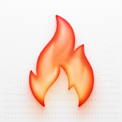
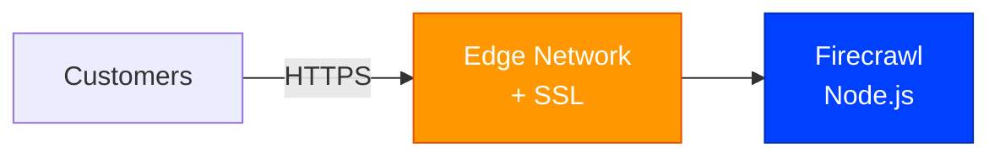
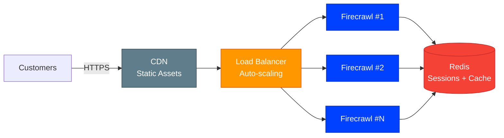

# Firecrawl [](https://github.com/stackblaze-templates/firecrawl) [](https://stackblaze.com) [](https://github.com/stackblaze-templates/firecrawl/actions) [](LICENSE) [](https://stackblaze.com)

<p align="center"></p>

An AI-ready web scraper. Turn any website into clean, LLM-ready markdown or structured data via API.

> **Credits**: Built on [Firecrawl](https://firecrawl.dev) by [Mendable](https://github.com/mendableai). All trademarks belong to their respective owners.

## Local Development

```bash
docker compose up
```

See the project files for configuration details.

## Deploy on StackBlaze

[](https://stackblaze.com)

This template includes a `stackblaze.yaml` for one-click deployment on [StackBlaze](https://stackblaze.com). Both options run on **Kubernetes** for reliability and scalability.

<details>
<summary><strong>Standard Deployment</strong> — Single-instance Kubernetes setup for startups and moderate traffic</summary>

<br/>



**What you get:**
- Single Firecrawl instance on Kubernetes
- Automatic SSL/TLS via StackBlaze edge network
- Automated daily backups
- Zero-downtime deploys

**Best for:** Development, staging, and moderate-traffic production environments.

</details>

<details>
<summary><strong>High Availability Deployment</strong> — Multi-instance Kubernetes setup for business-critical production</summary>

<br/>



**What you get:**
- Auto-scaling Firecrawl pods on Kubernetes behind a load balancer
- Redis for shared sessions, cache, and queue management
- CDN for static assets
- Automated failover and self-healing
- Zero-downtime rolling deploys

**Best for:** Production workloads, high-traffic applications, business-critical deployments.

</details>

## Security

### Required environment variables

Before deploying to production, set the following in your environment:

| Variable | Description | Required |
|---|---|---|
| `FIRECRAWL_API_KEY` | API key for authenticating requests to the Firecrawl API | **Yes** |
| `REDIS_URL` | Redis connection URL (e.g. `redis://redis:6379`) | **Yes** |

### Production hardening checklist

- **`FIRECRAWL_API_KEY`**: Always set a strong, randomly generated API key. The `stackblaze.yaml` configures this to be auto-generated on StackBlaze deployments.
- **Redis**: Do not expose the Redis port publicly. It is intentionally not mapped to a host port in `docker-compose.yml`.
- **Network exposure**: Only port `3002` (the Firecrawl API) should be reachable externally. Restrict access at the firewall/ingress level as needed.
- **`NODE_ENV`**: Set to `production` (already configured in `docker-compose.yml`) to disable development-mode debug output.

---

### Maintained by [StackBlaze](https://stackblaze.com)

This template is actively maintained by StackBlaze. We perform **weekly automated checks** to ensure:

- **Up-to-date dependencies** — frameworks, libraries, and base images are kept current
- **Security scanning** — continuous monitoring for known vulnerabilities and CVEs
- **Best practices** — configurations follow current recommendations from upstream projects

Found an issue? [Open a ticket](https://github.com/stackblaze-templates/firecrawl/issues).
